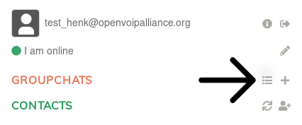
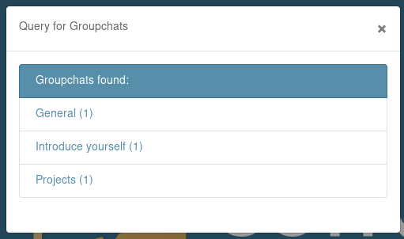

# How to join a group channel?
In XMPP, a group chat is called a "Multi-User Chat", MUC for short. To connect to the MUC's you can view the channels by letting your XMPP client query `conference.openvoipalliance.org`, which will return a list of channels you can join.

This is how you can browse and connect to channels using the [Converse](https://github.com/conversejs/converse.js/) client hosted at [xmpp.openvoipalliance.org](https://xmpp.openvoipalliance.org/):

